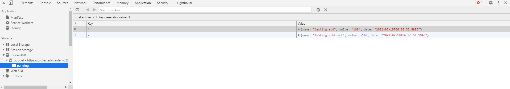
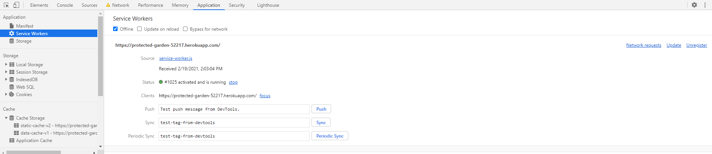

# Budget-Tracker


## Description
For unit 18's homework assignment I was tasked with saving values offline by utilizing indexedDB. With indexedDB users are able to store their submitted values while in an offline state. Once the users goes back online then the values will be stored into the database. I found this assignment to be a very important learning experience because it accommodates for a what if scenario and it is nice to know that there is a feature we can implement so that data loss can be prevented.

## Table Of Contents
- [Technologies](#Technologies-Used)
- [Installation](#Installation)
- [Usage](#Usage)
- [Screenshots](#Screenshots)
- [View Live Website](#View-Live-Website)
- [Questions](#Questions)
- [License](#License)

## Technologies Used
For this application I used the following technologies: MongoDb, Heroku, JavaScript, HTML/CSS, Node Express, Travis-CI, Mongodb Atlas, Mongoose, Morgan and IndexedDB.

## Installation
This application is easy to install, just clone the repository and run the following command in your terminal. 

```
npm install
```

This will create the node modules folder you will need in order for this application to function correctly.

## Usage
In order to get this application to run you must open up the terminal and enter the following:

```
node server.js
```
The application will then console log the url in the terminal that you will need to access the application. 

```
Server listening on: http://localhost:8080
```

Simply copy paste http://localhost:8080 into a browser of your choice.

## Screenshots
Saving values offline

Database updated when online 


## View Live Website  
Please click **[Here](https://protected-garden-52217.herokuapp.com/)** to view the live webpage hosted on Heroku


## Questions
To view my other repositories or to connect with me on GitHub please click **[Here](https://github.com/HustinKava/)**
If you have any questions please feel free to reach out to me at the following email: *hkavafsd@gmail.com*

## License


